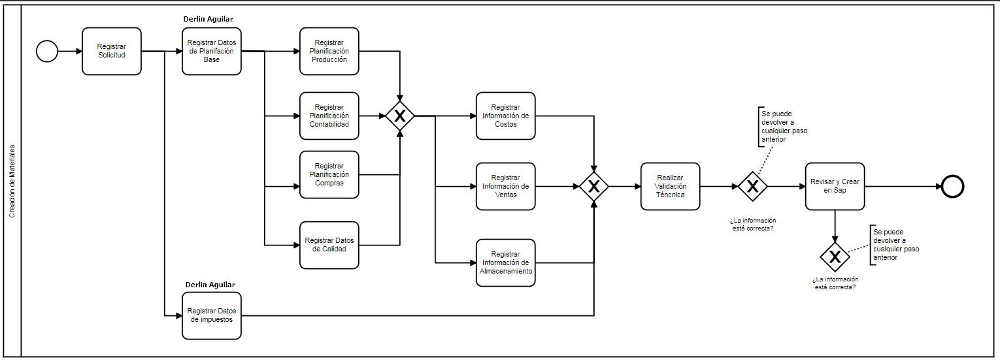

# Materiales

- ## 📚 Tabla de Contenido

1. [Diagramas](index.md#-diagramas "Diagramas")
2. [Descripción General](index.md#-descripción-general "Descripción General")
3. [Diligenciamiento Formularios](index.md#-diligenciamiento-formularios "Diligenciamiento Formularios")
4. [Código](index.md#-código "Código")

- ## ↗️ Diagramas

### Diagrama Flujo



---

### Prueba Solicitud

```
⚪ Inicio Proceso
      │
      │
5993 Registrar ─┬── 5995 Registrar Datos
Solicitud       │   Planificación Base
                │             │
                │             │
                │             │
                │             │
                │      5996 Registrar Información ────┐
                │      de Costos                      │
                │             │                       │
                │             │                       │
                │      5997 Registrar Información ────┤
                │      de Ventas                      │
                │             │                       ├─── 5999 Realizar      ─── 6000 Revisar y
                │             │                       │    Validación Técnica     Crear en Sap
                │      5998 Registrar Información ────┤                                 │
                │      de Almacenamiento              │                                 │
                │                                     │                                 │
                │                                     │                                 │
                │                                     │                           ⚫Fin Proceso
                │                                     │
                └── 5994 Registrar Datos ─────────────┘
                    de Impuestos
```

---

### Bosquejo


- ## 🎏 Descripción General

### Proceso

Materiales: **8**

---

### Actividades

| Actividad | Detalle                                 | Id sol_plantillas_cliente | Id frm_Formularios | Formulario |
| --------- | --------------------------------------- | ------------------------- | ------------------ | ---------- |
| 80        | Registrar Solicitud                     | 8                         | 80                 | p8_f1      |
| 81        | Registrar Datos Planificación Base      |                           | 81                 | P8_f2      |
| 82        | Registrar Datos de Impuestos            |                           | 82                 | p8_f3      |
| 83        | Registrar Planificación Producción      |                           | 83                 | p8_f4      |
| 84        | Registrar Planificación Contabilidad    |                           | 84                 | p8_f5      |
| 85        | Registrar Planificación Compras         |                           | 85                 | p8_f6      |
| 86        | Registrar Datos de Calidad              |                           | 86                 | p8_f7      |
| 87        | Registrar Información de Costos         |                           | 87                 | p8_f8      |
| 88        | Registrar Información de Ventas         |                           | 88                 | p8_f9      |
| 89        | Registrar Información de Almacenamiento |                           | 89                 | p8_f10     |
| 90        | Realizar Validación Técnica             |                           | 90                 | p8_f11     |
| 91        | Revisar y Crear en SAP                  |                           | 91                 | p8_f12     |
| 92        | Aprobación Vicepresidencia o Sociedad   |                           | 92                 | p8_f17     |


## 📋 Diligenciamiento Formularios

1. [Registrar Solicitud](./furmularios/80_registrar_solicitud.md "Formulario Registrar Solicitud")

2. [Registrar Datos Planificación Base](./furmularios/81_registrar_datos_planificacion_base.md "Registrar Datos Planificación Base")

3. [Registrar Datos de Impuestos](./furmularios/82_registrar_datos_de_impuestos.md "Registrar Datos de Impuestos")

4. [Registrar Planificación Producción](./furmularios/83_registrar_planificacion_produccion.md "Registrar Planificación Producción")

5. [Registrar Planificación Contabilidad](./furmularios/84_registrar_planificacion_contabilidad.md "Registrar Planificación Contabilidad")

6. [Registrar Planificación Compras](./furmularios/85_registrar_planificacion_compras.md "Registrar Planificación Compras")

7. [Registrar Datos de Calidad](./furmularios/86_registrar_datos_calidad.md "Registrar Datos de Calidad")

8. [Registrar Información de Costos](./furmularios/87_registrar_informacion_de_costos.md "Registrar Información de Costos")

9. [Registrar Información de Ventas](./furmularios/88_registrar_informacion_de_ventas.md "Registrar Información de Ventas")

10. [Registrar Información de Alamcenamiento](./furmularios/89_registrar_informacion_de_almacenamiento.md "Registrar Información de Almacenamiento")

11. [Realizar Validación Técnica](./furmularios/90_realizar_validacion_tecnica.md "Realizar Validación Técnica")

12. [Revisar y Crear en SAP](./furmularios/91_revisar_y_crear_en_sap.md "Revisar y Crear en SAP")

13. [	Aprobación Vicepresidencia o Sociedad](./furmularios/92_aprobacion_videpresidencia_o_sociedad.md "Aprobación Vicepresidencia o Sociedad")

## 📝 Código

- [getActividadesFlujoGenerables()](./codigo/getActividadesFlujoGenerables.md "getActividadesFlujoGenerables()")


